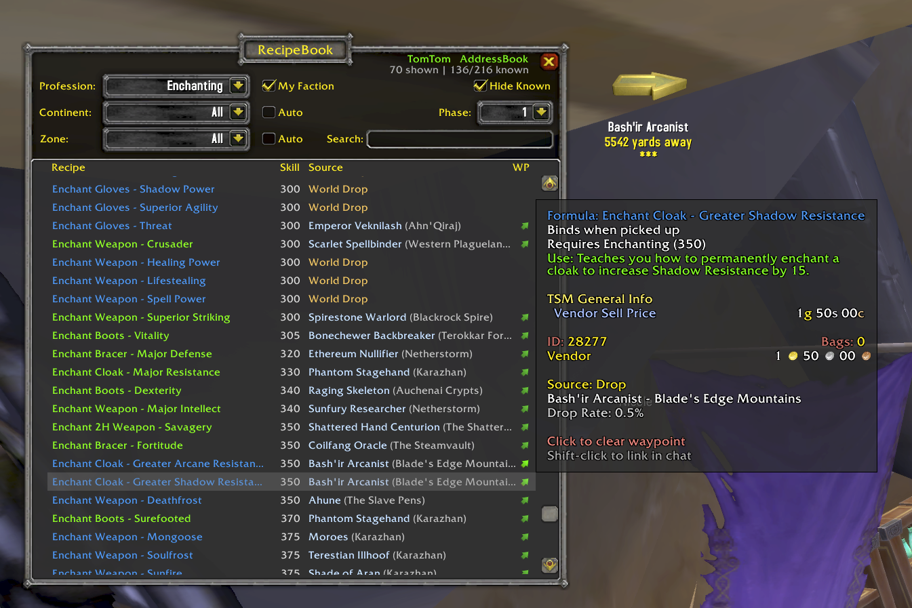

<p align="center">
  
</p>

<h1 align="center">RecipeBook</h1>

<p align="center">
  A World of Warcraft TBC Anniversary addon for browsing profession recipes by source type.<br/>
  Track known recipes, filter by zone, phase, and faction, and set waypoints to vendors and trainers.
</p>

<p align="center">
  <strong>Author:</strong> Breakbone - Dreamscythe&nbsp;&nbsp;|&nbsp;&nbsp;<strong>Interface:</strong> 20505 (TBC Anniversary)
</p>

---

## Browse Recipes

View every TBC profession recipe organized by source type — Trainer, Vendor, Quest, Drop, and more. Collapsible sections let you focus on what matters. Recipes show name, required skill, and source details at a glance.



- 12 professions: Alchemy, Blacksmithing, Cooking, Enchanting, Engineering, First Aid, Fishing, Jewelcrafting, Leatherworking, Mining, Poisons, Tailoring
- Recipes grouped by source type with counts
- Recipe names colored by item quality
- Shift-click any recipe to link it in chat

## Guild Crafts

See which guildmates can craft what. A Guild entry in the Character dropdown replaces the Source column with a live list of guildmates who know each recipe — online ones are class-colored with their current zone, offline ones are greyed.

- Right-click any crafter for **Whisper** (pre-filled polite message with the recipe link), **Invite**, **Who**, or **Copy Name**
- Opt-in via Settings → Guild Sharing (default off, one-time prompt on first guild join)
- Customizable whisper template with `{name}` and `{recipe}` placeholders
- Recipe data syncs over a private addon-message channel — no visible chat spam
- Efficient sync: timestamped-hash handshake transfers only what's changed

## Known Recipe Tracking

Open your profession window and RecipeBook automatically scans what you've learned. Toggle **Hide Known** to see only the recipes you still need.

- Smart profession dropdown separates your known professions from others
- Hide Known auto-enables for professions you've opened

## Filtering

Narrow results with multiple filter options that work together:

- **Continent & Zone** — dropdown filters with Auto-detect mode for your current location
- **Phase** — filter by content phase (1–5) to see only what's available now
- **My Faction** — hide opposite-faction vendors and quests (enabled by default). Non-BoP vendor recipes remain visible since they're tradeable via neutral AH; opposite-faction vendors are marked with (A) or (H)
- **Search** — filter by recipe name as you type

## Waypoint Integration

Click the green arrow next to any vendor or trainer to set a TomTom waypoint via AddressBook. Trainers link to the nearest trainer for that profession.

- Requires both [AddressBook](https://www.curseforge.com/wow/addons/addressbook) and [TomTom](https://www.curseforge.com/wow/addons/tomtom)

## Data Sources

Recipe data is sourced from [RecipeMaster TBC](https://www.curseforge.com/wow/addons/recipe-master).

## Usage

- **Minimap button** — left-click to toggle the window
- `/rb` — toggle RecipeBook
- `/rb phase <N>` — set max phase (1–5)
- `/rb reset` — reset window position

## Dependencies

RecipeBook ships with these bundled libraries:

- LibStub
- CallbackHandler-1.0
- LibDataBroker-1.1
- LibDBIcon-1.0

**Optional:** AddressBook + TomTom for waypoint integration.

## Installation

Extract the `RecipeBook` folder into your WoW AddOns directory:

```
World of Warcraft/_anniversary_/Interface/AddOns/RecipeBook/
```

After installation, open all of your profession panels to allow RecipeBook to scan your known recipes.

## For Addon Developers

RecipeBook exposes a stable public API at `RecipeBook.API` so other addons can query the recipe catalog and known-recipe data without scanning professions themselves.

Soft-probe:

```lua
local function HasRecipeBook()
    return _G.RecipeBook
       and _G.RecipeBook.API
       and (_G.RecipeBook.API.VERSION or 0) >= 1
end
```

### Core methods (v1)

| Method | Returns |
| --- | --- |
| `RecipeBook.API:GetAllProfessions()` | array of profession names (alphabetised) |
| `RecipeBook.API:GetAllRecipes(profession)` | array of `RecipeRef` |
| `RecipeBook.API:GetKnownRecipes(charKey, profession)` | array of `RecipeRef` |
| `RecipeBook.API:GetKnownProfessions(charKey)` | array of profession names |
| `RecipeBook.API:GetRecipe(spellID)` | `RecipeRef` or `nil` |
| `RecipeBook.API:GetCharacters()` | array of `"Name-Realm"` keys |
| `RecipeBook.API:IsProfessionScanned(charKey, profession)` | bool |

`charKey` is `"Name-Realm"`; pass `nil` for the current character.

### RecipeRef shape

```lua
{
    spellID    = 27984,           -- primary key, locale-stable
    name       = "Mongoose",      -- localised
    profession = "Enchanting",
    link       = "|cff71d5ff|Hspell:27984|h[Mongoose]|h|r",
    recipeID   = 22545,           -- internal RB key (item ID for item recipes)
    itemID     = 22545,           -- present only for item recipes
    icon       = nil,             -- rarely populated; use GetSpellTexture(spellID)
}
```

### Contract

- **Pull-only.** No callbacks, no writes, no side effects.
- **Returns copies.** Mutating the returned tables never touches RB's state.
- **Nil-safe.** Unknown profession / charKey / recipe returns `{}` or `nil`.
- **`spellID` is primary key.** Locale-stable across client languages. Use it when persisting selections.
- **Safe after `PLAYER_LOGIN`.** Earlier calls may return empty.

See `API.lua` for the full contract and implementation.
